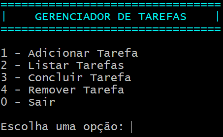

---

# Gerenciador de Tarefas - C#

Este projeto é um gerenciador de tarefas desenvolvido em C# que permite ao usuário adicionar, listar, concluir e remover tarefas.

🚀 **Funcionalidades**

✅ Adicionar novas tarefas.

✅ Listar todas as tarefas cadastradas.

✅ Concluir uma tarefa.

✅ Remover uma tarefa.

✅ Validação de entradas e mensagens de erro personalizadas.

📂 **Estrutura do Projeto**

📦 GerenciadorDeTarefas  
┣ 📜 **Program.cs** # Ponto de entrada da aplicação  
┣ 📜 **GerenciadorDeTarefas.cs** # Lógica de gerenciamento das tarefas  
┣ 📜 **Tarefa.cs** # Definição da classe Tarefa  
┣ 📜 **Layout.cs** # Responsável pela formatação da interface  
┣ 📜 **README.md** # Documentação do projeto  

🛠 **Tecnologias Utilizadas**

- C#
- .NET Core/Framework
- Console Application

📌 **Como Executar o Projeto**

1️⃣ Clone este repositório:

```bash
git clone https://github.com/arthrs7/GerenciadorTarefas.git
```

2️⃣ Acesse o diretório do projeto:

```bash
cd GerenciadorTarefas
```

3️⃣ Compile e execute o programa:

```bash
dotnet run
```

📝 **Exemplo de Uso**



Escolha a opção desejada e interaja com o sistema de gerenciamento de tarefas.

💡 **Obrigado pela atenção!!** 🚀

---
